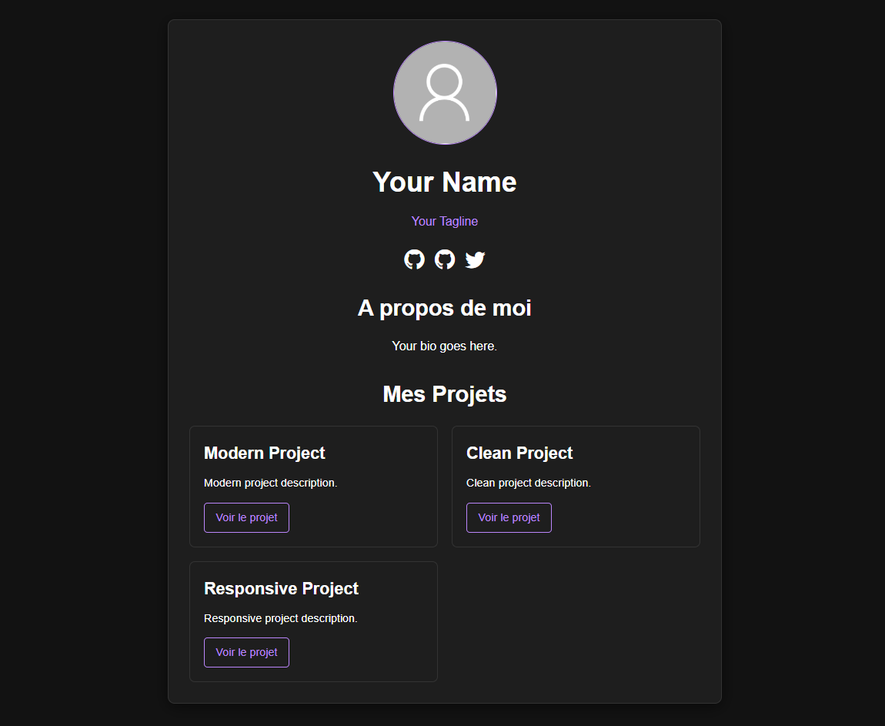

# 🌟 Modern Profile Card

A beautiful, responsive profile card template perfect for creating your own personal link-in-bio page. Think Linktree, but with a modern design and full customization control.

<p align="center">
  
  
  
  
</p>

<p align="center">
  <a href="#-features">Features</a> •
  <a href="#-demo">Demo</a> •
  <a href="#-installation">Installation</a> •
  <a href="#-configuration">Configuration</a> •
  <a href="#-customization">Customization</a> •
  <a href="#-contributing">Contributing</a>
</p>

## ✨ Features

- 🎨 **Modern Design** - Glassmorphism effects with smooth animations
- 🌙 **Dark/Light Mode** - Toggle between themes with persistent storage
- 📱 **Fully Responsive** - Perfect on all devices and screen sizes
- ⚡ **Fast & Lightweight** - Pure CSS and vanilla JavaScript
- 🔧 **Easy Configuration** - Simple config file to customize everything
- 🎯 **SEO Friendly** - Optimized meta tags and semantic HTML
- 🌐 **Cross-browser** - Works on all modern browsers

## 🚀 Demo

> **[Live Demo](https://card-page-web.vercel.app/)** ← Click to see it in action!

### Preview


## 📦 Installation

### Option 1: Download ZIP
1. Click the green "Code" button above
2. Select "Download ZIP"
3. Extract the files
4. Open `index.html` in your browser

### Option 2: Clone Repository
```bash
git clone https://github.com/Cut0x/card-page-web.git
cd card-page-web
```

### Option 3: Use as Template
1. Click "Use this template" button
2. Create your new repository
3. Clone your new repository

## ⚙️ Configuration

All customization is done through the `config.js` file. Simply edit your information:

```javascript
const config = {
    // Your basic information
    user: {
        name: "Your Name",
        tagline: "Your profession or description",
        avatar: "your-image-url.jpg"
    },
    
    // Your social media links
    socialNetworks: [
        {
            name: "GitHub",
            link: "https://github.com/yourusername",
            icon: "bi-github"
        }
        // Add more social links...
    ],
    
    // Your main links/projects
    projects: [
        {
            title: "My Portfolio",
            description: "Check out my work",
            link: "https://yourportfolio.com"
        }
        // Add more links...
    ]
};
```

## 🎨 Customization

### Available Icons
The template uses [Bootstrap Icons](https://icons.getbootstrap.com/). Popular options:

**Social Media:**
- `bi-github`, `bi-linkedin`, `bi-twitter-x`
- `bi-instagram`, `bi-youtube`, `bi-discord`
- `bi-facebook`, `bi-telegram`, `bi-whatsapp`

**Projects:**
- `bi-globe`, `bi-code-slash`, `bi-palette`
- `bi-cart`, `bi-phone`, `bi-envelope`

### Dark Theme
Customize the dark theme colors in your config:

```javascript
darkTheme: {
    background: "linear-gradient(135deg, #1a1a2e 0%, #16213e 100%)",
    cardBackground: "rgba(26, 26, 46, 0.95)",
    accentColor: "#bb86fc",
    textColor: "#f7fafc"
}
```

### CSS Variables
For advanced customization, modify the CSS variables in `style.css`:

```css
:root {
    --accent: #667eea;          /* Primary accent color */
    --bg-light: linear-gradient(...);  /* Light theme background */
    --card-light: rgba(...);    /* Card background */
}
```

## 🌐 Deployment

### GitHub Pages
1. Push your customized code to GitHub
2. Go to Settings → Pages
3. Select source: "Deploy from a branch"
4. Choose "main" branch
5. Your site will be available at `https://yourusername.github.io/repository-name`

### Netlify
1. Connect your GitHub repository
2. Deploy automatically on every push
3. Custom domain support available

### Vercel
1. Import your GitHub project
2. Automatic deployments
3. Built-in performance optimization

## 🤝 Contributing

Contributions are welcome! Here's how you can help:

1. **Fork** the repository
2. **Create** a feature branch (`git checkout -b feature/amazing-feature`)
3. **Commit** your changes (`git commit -m 'Add amazing feature'`)
4. **Push** to the branch (`git push origin feature/amazing-feature`)
5. **Open** a Pull Request

### Ideas for Contributions
- [ ] Additional animation effects
- [ ] More theme presets
- [ ] Analytics integration
- [ ] Contact form functionality
- [ ] Multi-language support

## 💖 Support

If you find this project helpful, please consider:

- ⭐ **Starring** the repository
- 🐛 **Reporting** bugs in the Issues section
- 💡 **Suggesting** new features
- 📢 **Sharing** with others

## 📞 Get Help

Need assistance? Here are your options:

- 📧 **Email**: [contact@valloic.dev](mailto:contact@valloic.dev)
- 🐦 **Twitter**: [@cut0x_](https://twitter.com/cut0x_)
- 🌐 **Website**: [valloic.dev](https://valloic.dev/pages/contact)
- 🐛 **Issues**: [GitHub Issues](https://github.com/Cut0x/card-page-web/issues)

## 🏆 Credits

**Developed and designed with ❤️ by [V Loïc (Cut0x)](https://valloic.dev/)**

---

<p align="center">
  <strong>⭐ Star this repository if it helped you!</strong>
</p>

<p align="center">
  Made with ❤️ and lots of ☕
</p>