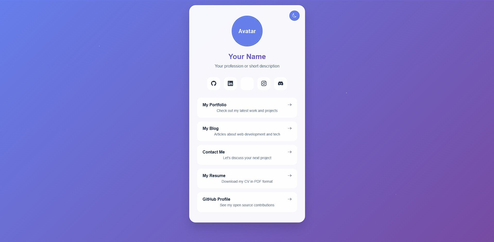

Here is a small template for a card page.

Need help? <a href="https://github.com/Cut0x/card-page-web#for-help">CLICK HERE!</a>

# Resources
`BootstrapIcons@1.10.5`, `HTML5`, `CSS3`, `JavaScript`

# How to configure?
Go to the **config.js** file (`./src/js/config.js`) and put your information there!
```js
const config = {
    user: {
      name: "Your Name",
      tagline: "Your Tagline",
      avatar: "https://app.akirasteam.com/uploads/pdp_default.png"
    },
    
    about: "Your bio goes here.",
    
    socialNetworks: [
      {
        name: "Discord",
        link: "https://discord.gg/",
        icon: "bi-github"
      },
      {
        name: "GitHub",
        link: "https://github.com/",
        icon: "bi-github"
      },
      {
        name: "Twitter",
        link: "https://twitter.com/",
        icon: "bi-twitter"
      }
    ],
    
    projects: [
      {
        title: "Modern Project",
        description: "Modern project description.",
        link: "https://example.com/modern-project"
      },
      {
        title: "Clean Project",
        description: "Clean project description.",
        link: "https://example.com/clean-project"
      },
      {
        title: "Responsive Project",
        description: "Responsive project description.",
        link: "https://example.com/responsive-project"
      }
    ],
    
    /* DARK THEME */
};
```

# For help
I invite you to contact me on my <a href="https://twitter.com/cut0x_" target="_blank">Twitter</a> or on my <a href="https://valloic.dev/pages/contact" target="_blank">contact page</a> by private message.

# Preview


# Credit
Developed and designed with ❤️ by <a href="https://valloic.dev/">V Loïc (aka Cut0x)</a>.
<br>